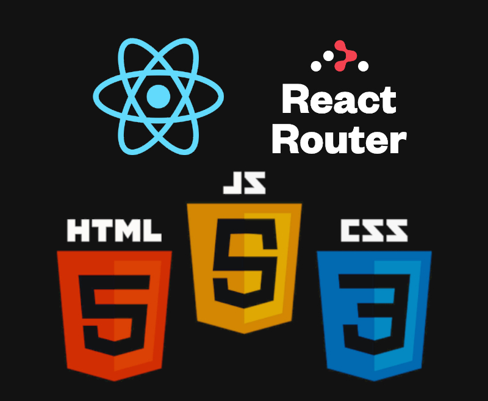

# Kasa - Location d'appartements entre particuliers

Je suis Jérémy Darbellay, développeur front-end freelance recruté par Kasa. 

Dans ce projet, nous allons construire une plateforme web de location d'appartements entre particuliers afin d'effectuer la migration de ASP.NET vers une stack javascript basée sur Node et React.
Ce projet ne contiendra que la partie Front-End avec React et React-Router, sans autres dépendances.

# Sommaire
+ [Kasa - Location d'appartements entre particuliers](#kasa-location-dappartements-entre-particuliers)
+ [Sommaire](#sommaire)
+ [Installation et lancement](#installation-et-lancement)
+ [Démonstration](#démonstration)
+ [Technologies utilisées](#technologies-utilisées)
+ [License](#license)

# Installation et lancement

Prérequis : Vous devez avoir nodejs et npm installés et fonctionnels, suivez ce lien pour installer les dernières versions stables : [installer Node.Js](https://nodejs.org/fr)

Voici les étapes à suivre pour lancer le projet en local :

1. créer le dossier qui contiendra le projet : `mkdir myNewProject`
2. cloner le projet dans ce dossier : `git clone https://github.com/JeremyDarbellay/projet_6_openclassrooms.git ./myNewProjet`
3. naviguer dans ce dossier : `cd myNewProject`
4. installer les modules associés : `npm install`

Pour démarrer le projet, lancez `npm start`
Pour lancer les tests, lancez `npm test`
Pour générer un build, lancez `npm run build`

# Démonstration

Vous retrouverez la démonstration du site à cette adresse : [démonstration](https://jeremydarbellay.github.io/projet_6_openclassrooms). 
Ce site est publié à partir de la branche "build" qui est le résultat de la commande "npm run build" sur la branche "démo". Les trois seules différences sont l'ajout d'un basename dans le routeur, d'une homepage dans le package.json et d'une page 404.html qui est la copie de l'index.html (pour gérer les erreurs de route).

# Technologies utilisées

-----

Pour ce projet nous avons travaillé avec [React](https://react.dev/) (v18.2) et [React Router](https://reactrouter.com/en/main) (v6.9), sans ajouter d'autres librairies, en utilisant les langages HTML5, CSS3 et JavaScript.

L'application a été générée via [Create-React-App](https://create-react-app.dev/) (v5.0.1).

# License

[MIT](https://github.com/JeremyDarbellay/projet_6_openclassrooms/blob/main/LICENSE.md)

